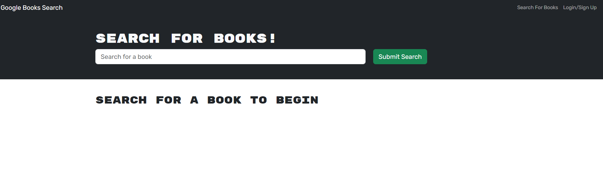
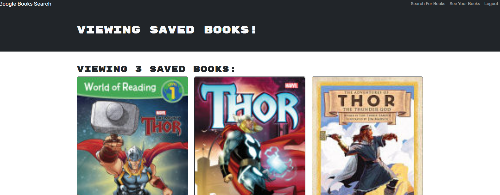
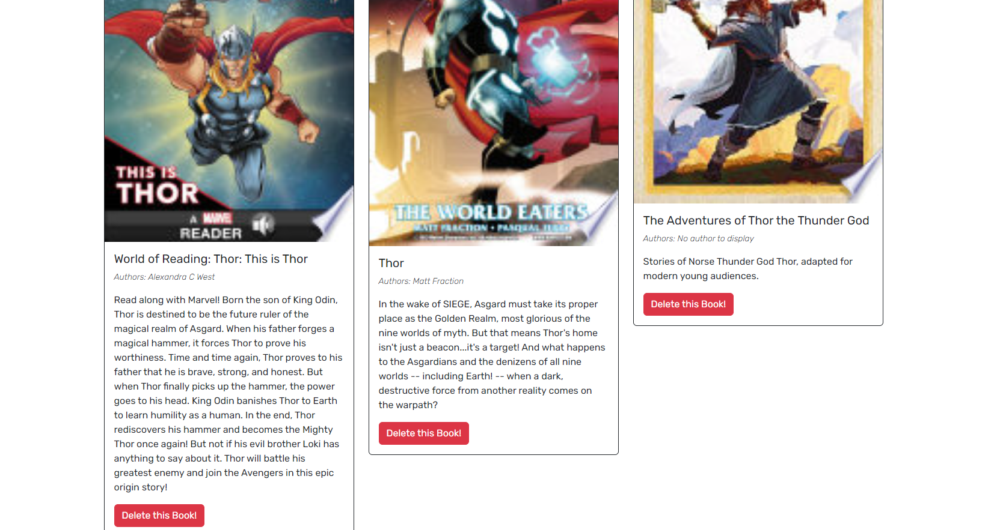
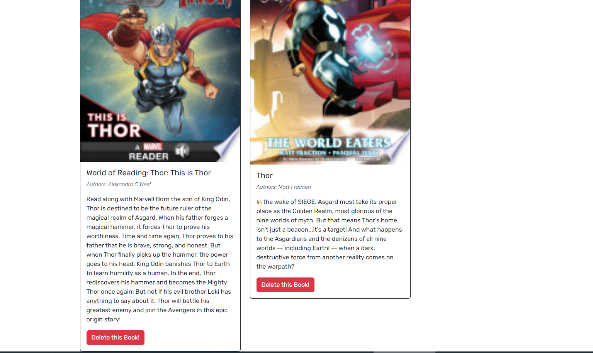

Title: BOOK-SEARCH

Description:
In this challenge, I have created a web application that is powered by React.js, Express and Apollo servers, as well as Graphql database schema. In this application, you can search for books and track the books that you would like to read. You can either sign up or log in to add books to your library and be able view them in Saved Books section of the website.
How to Run:
Please click on the deployed link in order to open the application. You can either type in a book name and do a search in the search bar, and read information about the book you are looking for or sign up/log in to save the books that you would like to read or learn more about. You can also delete the books as you wish inside save books section.

Github Repository : https://github.com/minikozort/Book-Search.git
Deployed Link : 